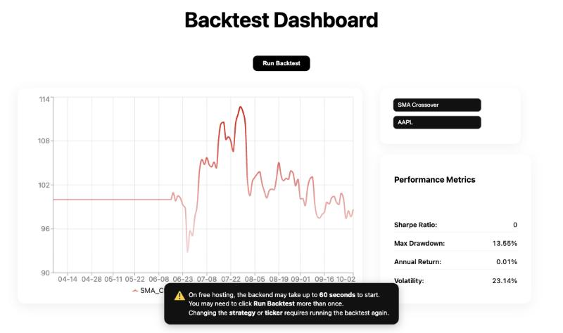

# QuantVision

A web dashboard for backtesting simple trading strategies on real stock data. Pick a strategy and a stock, and it simulates the strategy over the last six months, charts how the portfolio would have grown and reports its risk and return metrics.

**Live:** [quantvision.vercel.app](https://quantvision.vercel.app)

Built in October 2025 as an early project exploring how trading strategies are tested and evaluated.



## What it does

- **Three strategies**
  - **Momentum:** go long for the next day if today's return was positive, short if it was negative.
  - **Mean reversion:** the opposite bet: long after a down day, short after an up day.
  - **SMA crossover:** long while the 20-day moving average is above the 50-day average, short while it is below. The strategy stays flat until both averages exist.
- **Four stocks:** AAPL, MSFT, TSLA and GOOG, using six months of daily prices from Yahoo Finance.
- **Results:** an equity curve starting at 100 (green if it ends higher, red if lower), plus four metrics:
  - **Sharpe ratio:** annualised mean daily return divided by its standard deviation.
  - **Max drawdown:** the largest fall from a peak.
  - **Annual return** and **volatility**, both annualised from daily figures over 252 trading days.

## How it works

```
React (Vercel)  ──GET /run_strategy?name=…&ticker=…──▶  FastAPI (Render)  ──▶  Yahoo Finance (yfinance)
       ▲                                                       │
       └──────────── JSON: equity curve + metrics ◀────────────┘   pandas / NumPy backtest
```

1. The frontend sends the chosen strategy and ticker to the backend's `/run_strategy` endpoint.
2. The backend downloads six months of daily prices and computes daily returns with pandas.
3. It turns each day's data into a position: +1 (long), −1 (short) or 0 (flat).
4. Each position is applied to the **following** day's return. Shifting the signal by a day avoids look-ahead bias, where a backtest trades on information it wouldn't have had yet.
5. The cumulative product of the strategy's returns gives the equity curve, from which the metrics are computed.
6. The backend returns the curve as `[date, value]` pairs with the metrics, and the frontend draws it with Recharts.

The backend runs on Render's free tier, which sleeps when idle and can take up to a minute to wake. The frontend shows a notice if a request takes more than eight seconds and treats Render's 502–504 responses as "still starting", while showing real errors (such as an unknown ticker) as they are.

## Tech stack

| Layer | Technology |
| --- | --- |
| Frontend | React 19, Vite, Recharts, deployed on Vercel |
| Backend | Python, FastAPI, pandas, NumPy, yfinance, deployed on Render |
| Data | Yahoo Finance daily prices |

## API

`GET /run_strategy?name=<strategy>&ticker=<symbol>`

| Parameter | Values |
| --- | --- |
| `name` | `momentum`, `mean_reversion` or `sma_crossover` |
| `ticker` | Any Yahoo Finance symbol, such as `AAPL` |

It returns the equity curve as `[date, value]` pairs and the four metrics. An unknown strategy returns `400`, and a ticker with no data returns `404`, each with a `detail` message.

## Repository layout

```
frontend/   React app (Vite): the dashboard, in src/App.jsx
backend/    FastAPI app: the /run_strategy endpoint and backtest, in main.py
docs/       Screenshot
```

## Running it locally

**Backend:**

```bash
cd backend
pip install -r requirements.txt
uvicorn main:app --reload        # serves on http://localhost:8000
```

**Frontend**, in a second terminal:

```bash
cd frontend
npm install
echo "VITE_API_URL=http://localhost:8000" > .env.local   # omit to use the deployed backend
npm run dev                      # opens on http://localhost:5173
```

## Known limitations

This was an early project, and the backtest is deliberately simple. Its main gaps:

- **No transaction costs.** Momentum and mean reversion change position on most days, so ignoring trading costs makes their results unrealistic.
- **Momentum and mean reversion are mirror images.** Each is long exactly when the other is short, so they are really one bet with opposite signs. A more meaningful mean-reversion strategy would trade on how far the price has moved from its average.
- **"Annual return" compounds the average daily return.** The compound annual growth rate (CAGR), calculated from the start and end values, is the more standard measure.
- **Six months of data is too short to judge a strategy.** It covers a single market regime, and a Sharpe ratio estimated from about 125 days has wide uncertainty. A fuller test would cover several years and compare each strategy against simply buying and holding the stock.
- **The Sharpe ratio ignores the risk-free rate.**
- **Yahoo Finance occasionally returns no data to the hosted backend.** The app then shows a "no price data found" error; running the backtest again usually works.
